

  🇹🇷 Türkçe &nbsp;|&nbsp; <a href="README.en.md">🇬🇧 English</a>

  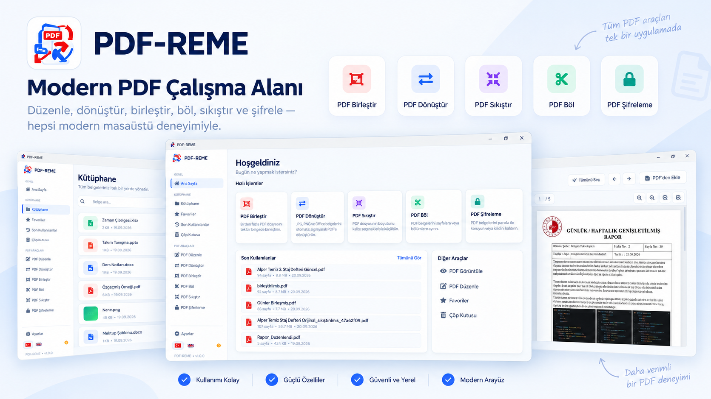

  PDF görüntüleme, sayfa düzenleme, birleştirme, bölme, dönüştürme, sıkıştırma ve güvenlik işlemlerini 
  modern bir masaüstü uygulamasında bir araya getiren, yerel çalışan PDF aracı.

  
  
  
  
  

## 📥 İndir

PDF-REME’nin Windows dağıtımları [GitHub Releases](https://github.com/alperrte/pdf-reme/releases) sayfasında iki paket türüyle yayımlanır.

| Paket | Kimler için? | Kullanım |
| --- | --- | --- |
| **Windows Setup** — `PDF-REME-vX.X.X-Setup.exe` | Standart Windows kurulumu isteyenler | Kurulum sihirbazını çalıştırın; Başlat menüsü ve isteğe bağlı masaüstü kısayoluyla normal bir kurulu program gibi kullanın. |
| **Portable** — `PDF-REME-vX.X.X-Portable.zip` | Kurulum yapmadan kullanmak isteyenler | ZIP’i indirin, bir klasöre çıkarın ve `PDF-REME.exe` dosyasını çalıştırın. |

  <a href="https://github.com/alperrte/pdf-reme/releases"><strong>GitHub Releases sayfasını aç →</strong></a>

Her sürüm için Setup ve Portable paketleri aynı uygulama özelliklerini sunar. Portable paket ayarlarını ve uygulama verilerini Windows kullanıcı belgeleri alanında tutar; yalnızca program dosyaları taşınabilirdir.

## PDF-REME nedir?

PDF-REME, günlük PDF ve belge işlemlerini tek bir PySide6 masaüstü arayüzünde buluşturan açık kaynak bir Windows uygulamasıdır. Belgeler işlenmek üzere bir web servisine yüklenmez; görüntüleme, düzenleme, dönüştürme, sıkıştırma ve güvenlik işlemleri kullanıcının kendi bilgisayarında gerçekleştirilir.

Yerel kütüphane; içe aktarılan ve oluşturulan belgeleri, favorileri, son kullanılanları ve çöp kutusunu tek noktadan yönetir. V1’de düzenleme sayfa tabanlıdır; PDF içindeki metin ve nesneleri doğrudan değiştiren içerik editörü gelecek sürümlerin kapsamındadır.

## ✨ V1 özellikleri

### PDF işlemleri

- PDF görüntüleme
- Birden fazla PDF’i sırası korunarak birleştirme
- Sayfa seçimine, özel gruplara veya parça sayısına göre PDF bölme
- Sayfaları sıralama, yer değiştirme, silme, döndürme ve çoğaltma
- Başka bir PDF’den sayfa veya yeni bir boş sayfa ekleme
- Seçili sayfaları yeni PDF olarak dışa aktarma
- Sayfa düzenleme geçmişinde geri alma ve yineleme

### Dönüştürme

- JPG, JPEG ve PNG görsellerini PDF’e dönüştürme
- PDF’in tamamını veya seçili sayfalarını JPG olarak dışa aktarma
- DOC ve DOCX belgelerini PDF’e dönüştürme
- PPT ve PPTX sunumlarını PDF’e dönüştürme
- XLS ve XLSX çalışma kitaplarını PDF’e dönüştürme

Office → PDF işlemleri, dağıtım paketine dahil edilen LibreOffice Runtime ile yerel olarak gerçekleştirilir.

### Sıkıştırma ve güvenlik

- Hafif, dengeli ve güçlü PDF sıkıştırma profilleri
- PDF’i kullanıcı parolasıyla koruma
- Parola biliniyorsa korumalı PDF’in kilidini kaldırarak yeni bir kopya oluşturma
- AES-256 tabanlı PDF şifreleme

### Belge yönetimi

- İçe aktarılan ve oluşturulan belgeler için yerel kütüphane
- Favoriler ve son kullanılanlar
- Çöp kutusuna taşıma, geri yükleme ve kalıcı silme
- Kaynak dosyayı değiştirmeden yeni çıktı oluşturma

### Kullanıcı deneyimi

- Türkçe ve İngilizce arayüz
- Açık ve koyu tema
- Hızlı işlemler sunan modern masaüstü arayüzü
- Temel belge işlemlerinde çevrimdışı kullanım

## 🖥️ Uygulamadan görüntüler

<table>
  <tr>
    <td width="50%" valign="top">
      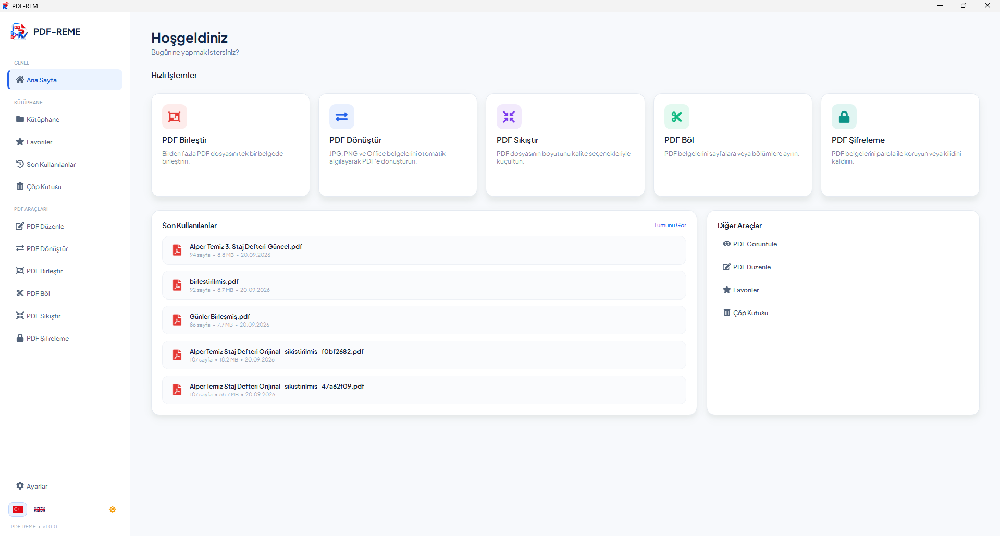
       <strong>Ana Sayfa</strong> — Sık kullanılan araçlara ve son belgelere hızlı erişim.
    </td>
    <td width="50%" valign="top">
      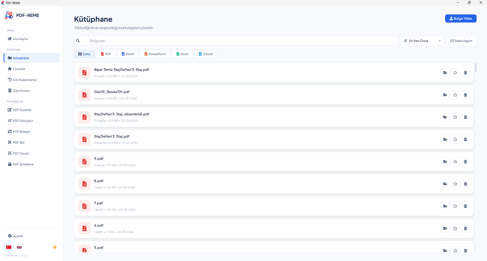
       <strong>Kütüphane</strong> — İçe aktarılan ve oluşturulan belgeleri tek noktadan yönetme.
    </td>
  </tr>
  <tr>
    <td width="50%" valign="top">
      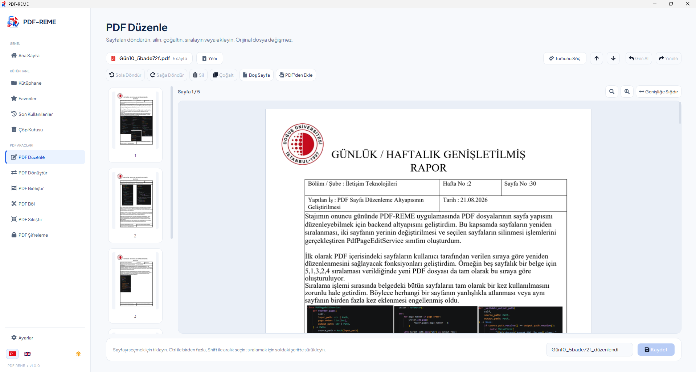
       <strong>PDF Düzenle</strong> — Sayfaları sıralama, silme, döndürme, çoğaltma ve ekleme.
    </td>
    <td width="50%" valign="top">
      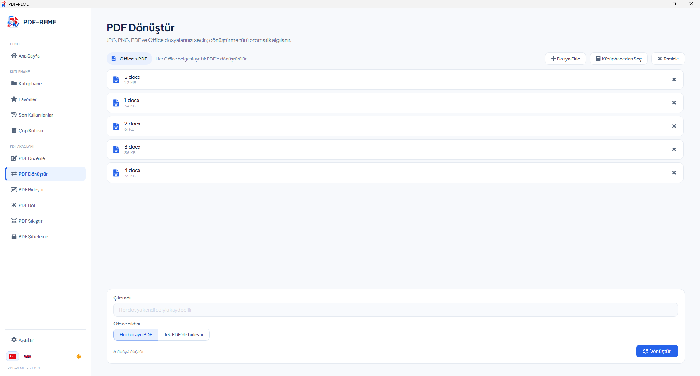
       <strong>PDF Dönüştür</strong> — Görsel ve Office belgeleri için yerel dönüşüm akışları.
    </td>
  </tr>
  <tr>
    <td width="50%" valign="top">
      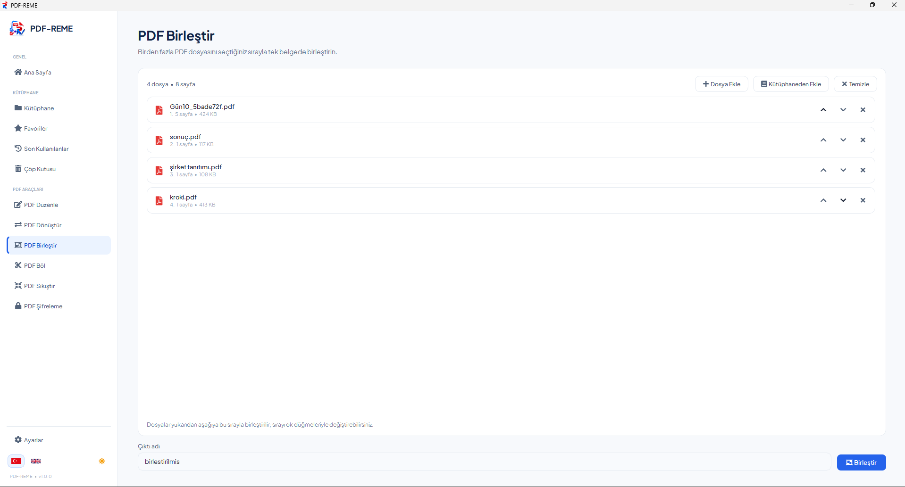
       <strong>PDF Birleştir</strong> — Birden fazla dosyayı seçilen sırayla tek PDF’te toplama.
    </td>
    <td width="50%" valign="top">
      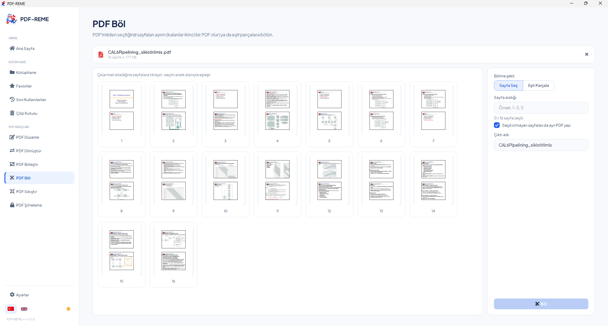
       <strong>PDF Böl</strong> — Sayfaları veya bölümleri ayrı PDF dosyalarına ayırma.
    </td>
  </tr>
  <tr>
    <td width="50%" valign="top">
      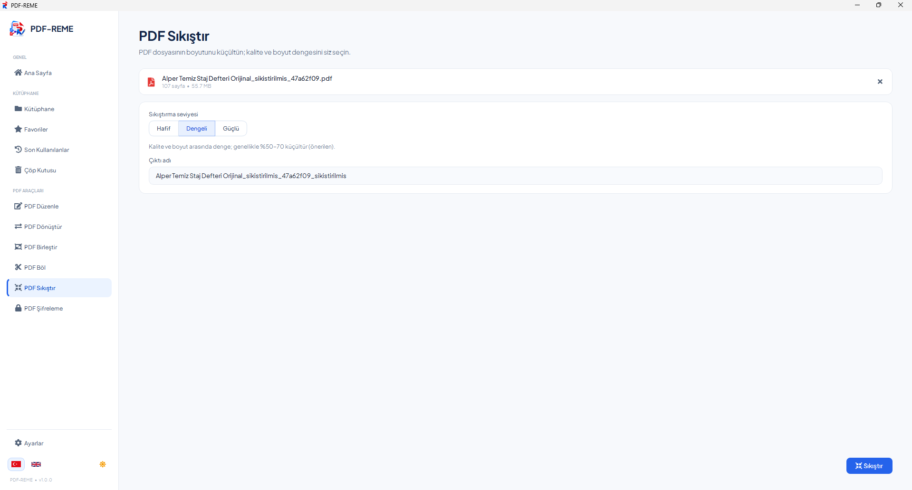
       <strong>PDF Sıkıştır</strong> — İhtiyaca uygun üç optimizasyon profili.
    </td>
    <td width="50%" valign="top">
      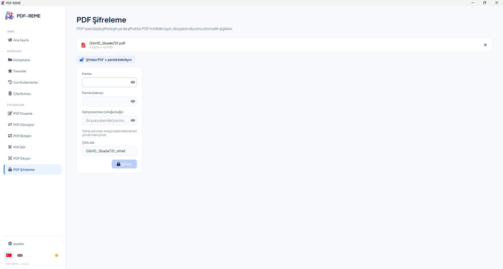
       <strong>PDF Şifrele</strong> — Belgeleri parola ve AES-256 şifreleme ile koruma.
    </td>
  </tr>
</table>

## 📁 Desteklenen formatlar

| İşlem | Formatlar |
| --- | --- |
| Görüntüleme ve PDF araçları | PDF |
| Görsel → PDF | JPG, JPEG, PNG → PDF |
| PDF → Görsel | PDF → JPG |
| Word → PDF | DOC, DOCX → PDF |
| PowerPoint → PDF | PPT, PPTX → PDF |
| Excel → PDF | XLS, XLSX → PDF |

## 🔒 Yerel çalışma

Belge görüntüleme ve işleme akışları yerel makinede çalışır; belgeler dönüşüm veya düzenleme için uzak bir servise gönderilmez. Uygulama yalnızca kullanıcı başlattığında veya ayarlardan etkinleştirildiğinde GitHub sürümlerini kontrol etmek için ağ bağlantısı kullanabilir.

## 🧰 Teknoloji yığını

  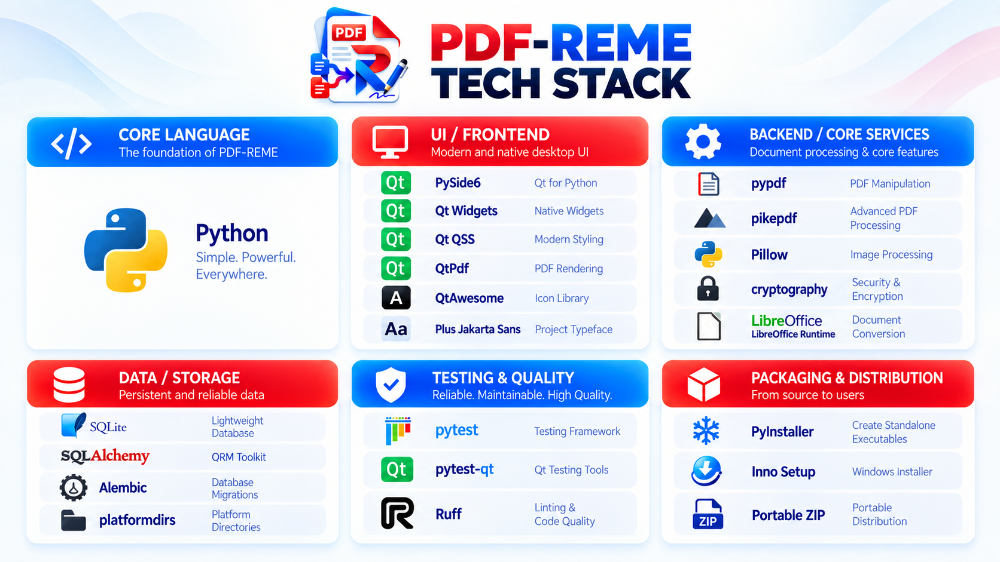

## 🗺️ Yol haritası

  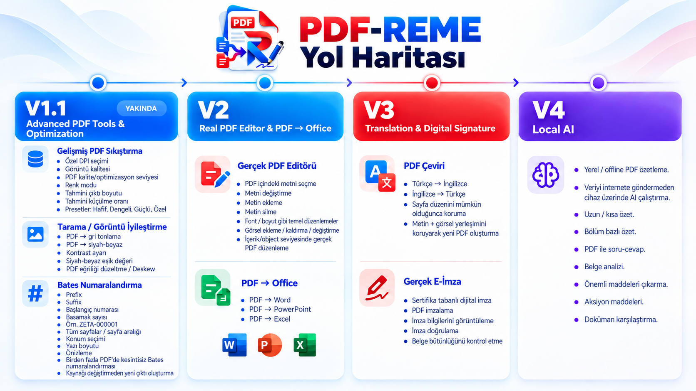

Geliştirme planı; V1.1’de gelişmiş PDF araçları ve optimizasyon, V2’de içerik düzeyinde düzenleme ve PDF → Office, V3’te çeviri ve dijital imza, V4’te ise yerel yapay zekâ özellikleriyle devam eder. Bu yetenekler V1’in parçası değildir.

## 💻 Sistem gereksinimleri

- 64 bit Windows
- Windows Setup veya Portable dağıtım paketi
- Office → PDF dönüşümü için ayrıca LibreOffice kurulumu gerekmez; gerekli Runtime pakete dahildir

## 📄 Lisans

PDF-REME, [Apache License 2.0](LICENSE) kapsamında lisanslanmaktadır.

## 👨‍💻 Geliştirici

**PDF-REME** 
[Alper Temiz](https://github.com/alperrte) tarafından geliştirilmektedir.
