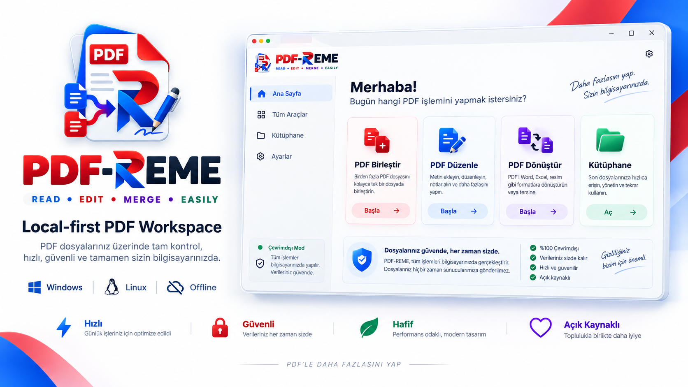
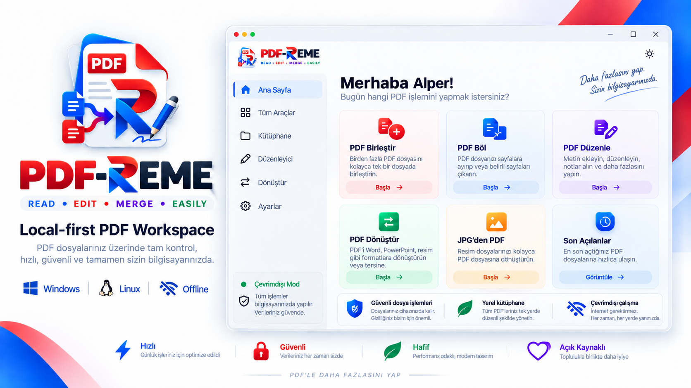
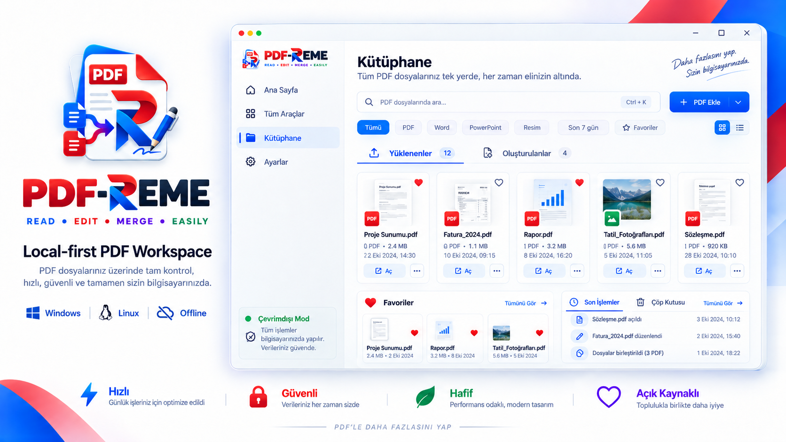
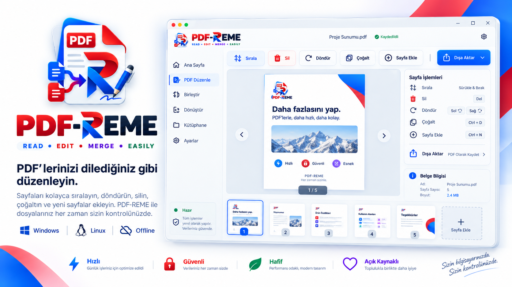
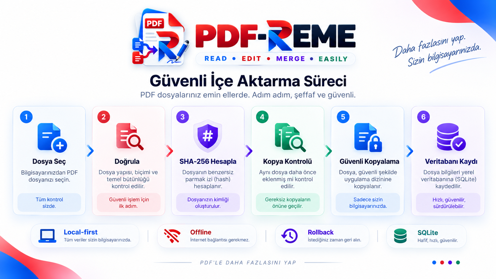
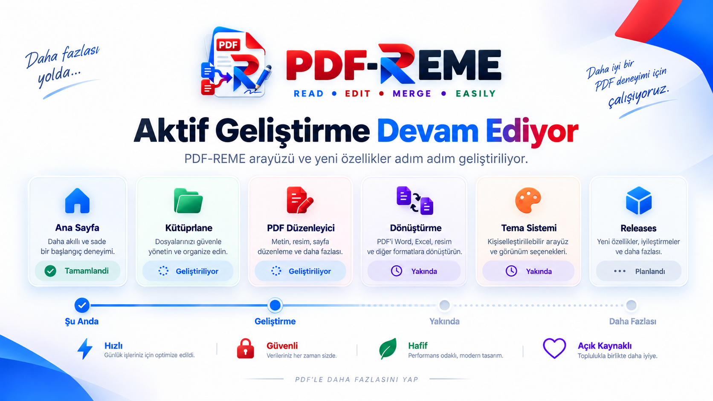

<div align="center">


# PDF-REME

### Read • Edit • Merge • Easily

Windows ve Linux için çevrimdışı, açık kaynak PDF ve belge yönetim aracı.

Belgelerinizi üçüncü taraf servislere yüklemeden görüntüleyin, düzenleyin, birleştirin, bölün ve dönüştürün.

<p>
  
  
  
  
  
  
  
</p>



</div>

## PDF-REME nedir?

PDF-REME; PDF ve belge işlemlerini mümkün olduğunca kullanıcının kendi bilgisayarında gerçekleştirmek üzere geliştirilen, ücretsiz ve açık kaynak bir masaüstü uygulamasıdır.

Temel hedefi; web tabanlı araçlara, bulut servislerine veya üçüncü taraf dönüştürücülere dosya yükleme ihtiyacını azaltan, sade ve güvenli bir **local-first** çalışma alanı sunmaktır.

> **Local-first:** Belgeleriniz varsayılan olarak cihazınızda kalır ve işlemler yerel olarak gerçekleştirilir.

## Ürün vizyonu

<div align="center">
  
</div>

Yukarıdaki görsel, PDF-REME için hazırlanan arayüz konseptidir. PySide6 tabanlı gerçek arayüz geliştirilirken bu tasarım dili referans alınacaktır.

V1 ile hedeflenen deneyim:

- PDF dosyalarını görüntüleme, birleştirme ve bölme
- Sayfaları sıralama, silme, döndürme ve çoğaltma
- Başka bir PDF'den sayfa ekleme
- JPG / JPEG / PNG → PDF
- DOC / DOCX → PDF
- PPT / PPTX → PDF
- Yerel belge kütüphanesi
- Favoriler ve son kullanılanlar
- Çöp kutusu ve geri yükleme
- Undo / Redo
- Light / Dark tema altyapısı
- Türkçe / İngilizce i18n altyapısı

> **Not:** Excel (XLS, XLSX) dönüşümü V1 kapsamına dahil değildir.

## Kütüphane konsepti

<div align="center">
  
</div>

PDF-REME kütüphanesi, içe aktarılan ve uygulama tarafından oluşturulan belgeleri tek bir yerden yönetmeyi hedefler.

- Yüklenenler ve oluşturulanlar
- Favoriler ve son kullanılanlar
- Arama, filtreleme ve dosya türüne göre ayrım
- Çöp kutusu
- Yerel metadata yönetimi

## PDF düzenleyici konsepti

<div align="center">
  
</div>

V1 düzenleyici, tam metin düzenleme yerine sayfa tabanlı PDF işlemlerine odaklanır.

- Sayfaları sürükle-bırak ile sıralama
- Sayfa silme, döndürme ve çoğaltma
- Başka bir PDF'den sayfa ekleme
- Seçili sayfaları dışa aktarma
- Undo / Redo
- Save / Save As

## Güvenli içe aktarma akışı

<div align="center">
  
</div>

PDF-REME'nin mevcut backend altyapısında bir dosya şu kontrollü akıştan geçirilir:

```text
Dosya seçimi
    ↓
Dosya doğrulama
    ↓
SHA-256 hesaplama
    ↓
Kopya kontrolü
    ↓
Güvenli yerel kopyalama
    ↓
Document metadata kaydı
    ↓
SQLite COMMIT / ROLLBACK
```

Bu yapı sayesinde:

- Kaynak dosya korunur.
- Aynı içeriğe sahip dosyalar SHA-256 üzerinden tespit edilir.
- Mevcut dosyanın üzerine yanlışlıkla yazılmaz.
- Yarım kalan `.part` dosyaları temizlenir.
- Veritabanı hatasında rollback uygulanır.
- Veritabanında karşılığı olmayan yetim kopyalar bırakılmaz.

## Aktif geliştirme

<div align="center">
  
</div>

PDF-REME şu anda aktif olarak geliştirilmektedir. Backend-first yaklaşımıyla önce çekirdek iş akışları ve güvenli veri yönetimi tamamlanmakta, ardından hazırlanan tasarım dili PySide6 arayüzüne uygulanmaktadır.

**Güncel checkpoint:** `53 passed`

- SQLite + SQLAlchemy veri katmanı
- Repository pattern ve Alembic migration altyapısı
- Transaction / rollback yönetimi
- SHA-256 hesaplama ve duplicate detection
- PDF ve görsel doğrulama
- DOCX / PPTX temel OOXML doğrulama
- Güvenli kütüphane kopyalama
- Gerçek PDF import akışı
- Metadata veritabanı kaydı
- Otomatik unit + integration testleri

## Güvenlik ve yerel çalışma

- Kaynak belge otomatik olarak değiştirilmez; uygulama kendi kontrollü kopyası üzerinde çalışır.
- Orijinal dosya yolu metadata olarak saklanır.
- Fiziksel belgeler SQLite içine BLOB olarak gömülmez.
- Aynı dosyanın tekrar eklenmesi SHA-256 ile tespit edilir.
- Başarısız kopyalamalarda geçici dosyalar temizlenir.
- Veritabanı işlemleri transaction sınırlarında yürütülür; hata halinde rollback uygulanır.
- Log kayıtlarında belge içeriğinin tutulmaması hedeflenir.
- Temel işlevlerin internet bağlantısı olmadan çalışması hedeflenir.

## Desteklenen dosya türleri

| İşlem | Dosya türleri |
| --- | --- |
| İçe aktarma | PDF, DOC, DOCX, PPT, PPTX, JPG, JPEG, PNG |
| V1 dönüşüm hedefleri | JPG / JPEG / PNG → PDF |
| | DOC / DOCX → PDF |
| | PPT / PPTX → PDF |

## Teknoloji yığını

| Alan | Teknoloji |
| --- | --- |
| Programlama dili | Python |
| Masaüstü UI | PySide6 + Qt Widgets |
| Stil | QSS |
| PDF işlemleri / görüntüleme | pypdf / PySide6 QtPdf |
| Görsel işlemleri | Pillow |
| Veritabanı / ORM | SQLite / SQLAlchemy |
| Migration | Alembic |
| Office → PDF | LibreOffice Runtime *(planlanan entegrasyon)* |
| Test / Kod kalitesi | pytest + pytest-qt / Ruff |
| Lisans | Apache License 2.0 |

## Mimari

PDF-REME, klasik bir web uygulaması gibi ayrı frontend/backend sunucuları kullanmaz. Masaüstü uygulaması içerisinde katmanlı bir yapı izlenir.

```text
src/pdf_reme/
├── presentation/      # PySide6 ekranları ve UI bileşenleri
├── application/       # Use-case ve application servisleri
├── domain/            # Domain modelleri ve repository arayüzleri
├── infrastructure/    # SQLite, filesystem, PDF ve conversion adaptörleri
├── shared/            # Paths, config, logging, i18n, theme
└── resources/         # İkonlar, görseller, stiller ve çeviriler
```

Temel amaç, UI katmanının SQLAlchemy, dosya sistemi veya PDF motoru gibi altyapı detaylarına doğrudan bağımlı olmamasıdır.

## Kurulum ve çalıştırma

### 1. Repository'yi klonlayın

```bash
git clone https://github.com/alperrte/pdf-reme.git
cd pdf-reme
```

### 2. Sanal ortam oluşturun

Windows (PowerShell):

```powershell
python -m venv venv
.\venv\Scripts\Activate.ps1
```

Linux:

```bash
python3 -m venv venv
source venv/bin/activate
```

### 3. Bağımlılıkları yükleyin

```bash
python -m pip install -r requirements.txt
```

### 4. Veritabanını hazırlayın

```bash
alembic upgrade head
```

### 5. Testleri çalıştırın

```bash
python -m pytest -v
```

### 6. Uygulamayı başlatın

```bash
python start_app.py
```

> Kullanıcı arayüzü halen aktif geliştirme aşamasındadır.

## Testler

Testlerde repository ve migration işlemleri, commit/rollback, kaynak dosyanın korunması, parçalı hashleme, dosya doğrulama, duplicate detection, güvenli `.part` kopyalama, hata durumunda temizlik ve gerçek import akışı doğrulanmaktadır.

## Yerel veri yapısı

```text
Documents/
└── PDF-REME/
    ├── database/
    │   └── pdf_reme.db
    ├── library/
    │   ├── imported/
    │   │   ├── pdf/
    │   │   ├── word/
    │   │   ├── powerpoint/
    │   │   └── images/
    │   └── generated/
    ├── thumbnails/
    ├── sessions/
    ├── autosave/
    ├── cache/
    ├── temp/
    ├── trash/
    ├── backups/
    └── logs/
```

## Yol haritası

### Backend / Core

- [x] Proje ve katmanlı mimari temeli
- [x] SQLite + SQLAlchemy
- [x] Repository ve Alembic migration altyapısı
- [x] Transaction yönetimi
- [x] Dosya doğrulama
- [x] SHA-256 / duplicate detection
- [x] Güvenli import
- [ ] Kütüphane servisleri
- [ ] Favoriler / Son kullanılanlar
- [ ] Çöp kutusu / Restore
- [ ] PDF görüntüleme
- [ ] Merge / Split ve sayfa işlemleri
- [ ] Undo / Redo
- [ ] Görsellerden PDF
- [ ] Office → PDF
- [ ] Autosave / Session recovery

### Frontend

- [x] Görsel tasarım dili / konsept çalışmaları
- [ ] PySide6 uygulama shell'i
- [ ] Ana sayfa ve kütüphane
- [ ] PDF düzenleyici
- [ ] Dönüştürme ekranları
- [ ] Light / Dark tema
- [ ] Backend entegrasyonu

### Release

- [ ] Windows Setup
- [ ] Windows Portable
- [ ] Linux paketi

## V1 kapsamı dışında

- PDF içindeki mevcut metin ve nesneleri Word benzeri düzenleme
- OCR ve Excel → PDF
- Elektronik imza
- Gelişmiş anotasyon ve form düzenleme
- Bulut senkronizasyonu ve kullanıcı hesabı
- Mobil uygulama ve macOS paketleme
- Otomatik güncelleme

## Katkıda bulunma

1. Repository'yi fork edin.
2. Ayrı bir branch oluşturun.
3. Değişikliklerinizi geliştirin.
4. Testleri çalıştırın.
5. Pull Request açın.

Proje halen V1 geliştirme sürecinde olduğu için mimari ve API'lerde değişiklikler olabilir.

## Lisans

PDF-REME, [Apache License 2.0](LICENSE) altında lisanslanmıştır.

## Geliştirici

<div align="center">

**Alper Temiz**

Yazılım Mühendisliği Öğrencisi • Full-Stack Developer • AI/ML Engineer

**PDF-REME — Read • Edit • Merge • Easily**

Belgeleriniz cihazınızda. İşlemleriniz kontrolünüzde.

⭐ Projeyi faydalı bulursanız yıldız verebilirsiniz.

</div>
