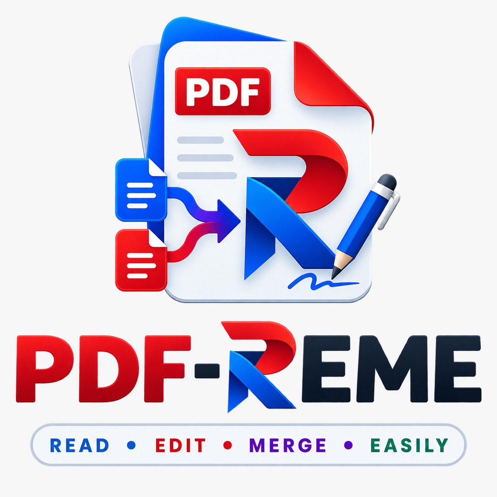

<div align="center">



<br><br>


# PDF-REME

### Read • Edit • Merge • Easily

**Windows ve Linux için çevrimdışı, açık kaynak PDF ve belge yönetim aracı.**

Belgelerinizi görüntüleyin, düzenleyin, birleştirin, bölün ve dönüştürün —  
**dosyalarınızı üçüncü taraf servislere yüklemeden, kendi bilgisayarınızda.**

<p>
  
  
  
  
  
  
  
</p>

</div>

---

## PDF-REME Nedir?

**PDF-REME**, PDF ve belge işlemlerini mümkün olduğunca kullanıcının kendi bilgisayarında gerçekleştirmek üzere geliştirilen ücretsiz ve açık kaynak bir masaüstü uygulamasıdır.

Temel hedef; PDF ve benzeri belgeleri işlemek için web tabanlı araçlara, bulut servislerine veya üçüncü taraf dönüştürücülere dosya yükleme ihtiyacını azaltan, sade ve güvenli bir **local-first** çalışma alanı sunmaktır.

> **Local-first:** Belgeleriniz varsayılan olarak cihazınızda kalır ve işlemler yerel olarak gerçekleştirilir.

---

## Ürün Vizyonu

<div align="center">


</div>

> Yukarıdaki görsel, PDF-REME için hazırlanan **arayüz konseptidir**. PySide6 tabanlı gerçek arayüz geliştirme sürecinde bu tasarım dili referans alınacaktır.

PDF-REME V1 ile hedeflenen deneyim:

- PDF dosyalarını görüntüleme
- PDF birleştirme ve bölme
- Sayfa sıralama, silme, döndürme ve çoğaltma
- Başka PDF'den sayfa ekleme
- JPG / JPEG / PNG → PDF
- DOC / DOCX → PDF
- PPT / PPTX → PDF
- Yerel belge kütüphanesi
- Favoriler ve son kullanılanlar
- Çöp kutusu ve geri yükleme
- Undo / Redo
- Light / Dark tema altyapısı
- Türkçe / İngilizce i18n altyapısı

> Excel (`XLS`, `XLSX`) dönüşümü V1 kapsamına dahil değildir.

---

## Kütüphane Konsepti

<div align="center">


</div>

PDF-REME kütüphanesi, içe aktarılan ve uygulama tarafından oluşturulan belgeleri tek bir yerden yönetmeyi hedefler.

Mevcut backend altyapısında:

- **Yüklenenler** ve **Oluşturulanlar** ayrımı yapılabilir,
- favori belgeler takip edilebilir,
- son kullanılan belgeler `last_opened_at` üzerinden sıralanabilir,
- belgeler çöp kutusuna taşınabilir ve geri yüklenebilir,
- fiziksel dosyalar dosya sisteminde, metadata bilgileri SQLite üzerinde tutulur.

Planlanan kullanıcı arayüzü yapısı:

- **Yüklenenler**
- **Oluşturulanlar**
- Favoriler
- Son kullanılanlar
- Arama ve filtreleme
- Dosya türüne göre ayrım
- Çöp kutusu
- Yerel metadata yönetimi

---

## PDF Düzenleyici Konsepti

<div align="center">


</div>

V1 düzenleyici; tam metin düzenleme yerine **sayfa tabanlı PDF işlemlerine** odaklanır.

Planlanan işlemler:

- Sayfaları sürükle-bırak ile sıralama
- Sayfa silme
- Sayfa döndürme
- Sayfa çoğaltma
- Başka PDF'den sayfa ekleme
- Seçili sayfaları dışa aktarma
- Undo / Redo
- Save / Save As

> V1 kapsamında PDF içindeki mevcut metin ve nesnelerin Word benzeri biçimde düzenlenmesi hedeflenmemektedir.

---

## Güvenli İçe Aktarma Akışı

<div align="center">


</div>

PDF-REME'nin mevcut backend altyapısında gerçek bir dosya şu kontrollü akıştan geçirilebilir:

```text
Dosya Seç
    ↓
Dosya Doğrulama
    ↓
SHA-256 Hesaplama
    ↓
Kopya Kontrolü
    ↓
Güvenli Yerel Kopyalama
    ↓
Document Metadata Kaydı
    ↓
SQLite COMMIT / ROLLBACK
```

Bu yapı sayesinde:

- kaynak dosya korunur,
- aynı içeriğe sahip dosyalar SHA-256 üzerinden tespit edilir,
- mevcut dosyanın üzerine yanlışlıkla yazılmaz,
- yarım kalan `.part` dosyaları temizlenir,
- veritabanı hatasında rollback uygulanır,
- veritabanında karşılığı olmayan yetim kopyalar bırakılmaz.

---

## Çöp Kutusu ve Güvenli Silme Akışı

PDF-REME'nin mevcut backend altyapısında kütüphanedeki bir belge doğrudan kalıcı olarak silinmek yerine uygulamanın fiziksel çöp kutusuna taşınabilir.

```text
Kütüphane Belgesi
    ↓
TrashService.move_to_trash()
    ↓
Documents/PDF-REME/trash/
    ↓
status = trashed
trashed_from_path = önceki kütüphane yolu
deleted_at = silinme zamanı
```

Çöp kutusu altyapısında şu davranışlar uygulanmıştır:

- belgeyi fiziksel olarak `trash/` klasörüne taşıma,
- önceki kütüphane konumunu `trashed_from_path` ile saklama,
- belgeyi eski konumuna geri yükleme,
- restore sırasında aynı isimli dosyanın üzerine yazmama,
- çöp kutusundaki belgeleri listeleme,
- tek belgeyi kalıcı silme,
- çöp kutusunun tamamını temizleme,
- yalnızca PDF-REME `trash/` klasörü içindeki dosyalara kalıcı silme izni verme,
- kullanıcı dosyayı Explorer üzerinden elle silmiş olsa bile ilgili DB kaydını temizleyebilme,
- 30 günlük saklama süresini kontrol ederek süresi dolan kayıtları temizleme.

> `cleanup_expired()` ile 30 günlük backend kontrolü hazırdır. Bu kontrolün uygulama başlangıç akışına otomatik bağlanması PySide6 uygulama shell'i / frontend entegrasyonu sırasında yapılacaktır.

Gerçek dosya doğrulamasında aşağıdaki akış başarıyla test edilmiştir:

```text
Kütüphane
    ↓
Çöp Kutusu
    ↓
Geri Yükleme
    ↓
Çöp Kutusu
    ↓
Kalıcı Silme
```

---

## Aktif Geliştirme

<div align="center">


</div>

PDF-REME şu anda aktif olarak geliştirilmektedir.

Backend-first yaklaşımıyla önce çekirdek iş akışları ve güvenli veri yönetimi tamamlanmakta, ardından Stitch ile hazırlanan tasarım dili PySide6 arayüzüne uygulanacaktır.

### Güncel checkpoint

```text
95 passed
```

Şu anda tamamlanan temel altyapılar:

- [x] SQLite + SQLAlchemy veri katmanı
- [x] Repository pattern
- [x] Alembic migration altyapısı
- [x] Transaction / rollback yönetimi
- [x] SHA-256 hesaplama
- [x] Duplicate detection
- [x] PDF ve görsel doğrulama
- [x] DOCX / PPTX temel OOXML doğrulama
- [x] Güvenli kütüphane kopyalama
- [x] Gerçek PDF import akışı
- [x] Metadata veritabanı kaydı
- [x] Kütüphane servisleri
- [x] Yüklenenler / Oluşturulanlar ayrımı
- [x] Favoriler
- [x] Son kullanılan belgeler
- [x] Çöp kutusuna taşıma
- [x] Geri yükleme
- [x] Kalıcı silme
- [x] Çöp kutusunu toplu temizleme
- [x] 30 günlük çöp kutusu retention kontrolü
- [x] Gerçek dosya ile trash / restore / permanent delete testi
- [x] Otomatik unit + integration testleri

---

## Güvenlik ve Yerel Çalışma Yaklaşımı

PDF-REME geliştirilirken belge güvenliği temel ürün ilkelerinden biridir.

- Kaynak belge otomatik olarak değiştirilmez.
- Uygulama kendi kontrollü kopyası üzerinde çalışır.
- Orijinal dosya yolu metadata olarak saklanır.
- Fiziksel belgeler SQLite içine BLOB olarak gömülmez.
- Aynı dosyanın tekrar eklenmesi SHA-256 ile tespit edilir.
- Başarısız kopyalamalarda geçici dosyalar temizlenir.
- Veritabanı işlemleri transaction sınırlarında yürütülür.
- Hata halinde rollback uygulanır.
- Çöp kutusuna taşınan belgenin önceki uygulama yolu ayrıca saklanır.
- Kalıcı silme yalnızca PDF-REME'nin kendi `trash/` alanıyla sınırlandırılır.
- Restore işleminde aynı isimli dosyanın üzerine yazılmaz.
- Çöp kutusundaki fiziksel dosyalar kullanıcı tarafından Dosya Gezgini üzerinden erişilebilir durumdadır.
- Log kayıtlarında belge içeriğinin tutulmaması hedeflenir.
- Temel işlevlerin internet bağlantısı olmadan çalışması hedeflenir.

---

## Desteklenen Dosya Türleri

### İçe aktarma

`PDF` • `DOC` • `DOCX` • `PPT` • `PPTX` • `JPG` • `JPEG` • `PNG`

### V1 dönüşüm hedefleri

- JPG / JPEG / PNG → PDF
- DOC / DOCX → PDF
- PPT / PPTX → PDF

---

## Teknoloji Yığını

| Alan | Teknoloji |
|---|---|
| Programlama dili | Python 3.10+ |
| Masaüstü UI | PySide6 + Qt Widgets |
| Stil | QSS |
| PDF işlemleri | pypdf |
| PDF görüntüleme | PySide6 QtPdf |
| Görsel işlemleri | Pillow |
| Veritabanı | SQLite |
| ORM | SQLAlchemy |
| Migration | Alembic |
| Office → PDF | LibreOffice Runtime *(planlanan entegrasyon)* |
| Test | pytest + pytest-qt |
| Kod kalitesi | Ruff |
| Lisans | Apache License 2.0 |

---

## Mimari

PDF-REME klasik bir web uygulaması gibi ayrı frontend/backend sunucuları kullanmaz.  
Masaüstü uygulaması içerisinde katmanlı bir yapı izlenir.

```text
src/pdf_reme/
├── presentation/      # PySide6 ekranları ve UI bileşenleri
├── application/       # Use-case ve application servisleri
├── domain/            # Domain modelleri ve repository arayüzleri
├── infrastructure/    # SQLite, filesystem, PDF ve conversion adaptörleri
├── shared/            # Paths, config, logging, i18n, theme
└── resources/         # İkonlar, görseller, stiller ve çeviriler
```

Temel amaç, UI katmanının SQLAlchemy, dosya sistemi veya PDF motoru gibi altyapı detaylarına doğrudan bağımlı olmamasıdır.

Çöp kutusu özelliğinde bu ayrım örneğin şöyle uygulanır:

```text
Presentation (ileride PySide6)
        ↓
TrashService
        ↓
DocumentRepository + TrashFileManager
        ↓
SQLite + Dosya Sistemi
```

---

## Testler

Tüm mevcut testleri çalıştırmak için:

```bash
python -m pytest -v
```

Güncel geliştirme checkpoint'i:

```text
95 passed
0 failed
```

Testlerde örnek olarak şu senaryolar doğrulanmaktadır:

- başarılı repository işlemleri,
- migration upgrade / downgrade,
- commit / rollback,
- kaynak dosyanın korunması,
- büyük dosyaların parça parça hashlenmesi,
- bozuk PDF ve görsel reddi,
- sahte DOCX / PPTX reddi,
- duplicate detection,
- güvenli `.part` kopyalama,
- veritabanı hatasında fiziksel dosya temizliği,
- gerçek import akışı,
- yüklenen / oluşturulan belge ayrımı,
- favori açma / kapama,
- son kullanılan belgelerin sıralanması,
- dosyanın fiziksel çöp kutusuna taşınması,
- çöp kutusundan geri yükleme,
- restore sırasında isim çakışmasının güvenli çözülmesi,
- çöp kutusu dışındaki dosyaların kalıcı silinmesinin engellenmesi,
- fiziksel dosya daha önce elle silinmişse DB kaydının temizlenmesi,
- çöp kutusunun toplu temizlenmesi,
- 29 günlük kaydın korunması,
- tam 30 günlük ve daha eski kayıtların temizleme kapsamına alınması,
- Alembic migration upgrade / downgrade regresyonu,
- gerçek PDF ile trash → restore → permanent delete akışı,
- genel regresyon kontrolleri.

Gerçek çöp kutusu akışını manuel olarak doğrulamak için:

```bash
python scripts/manual_trash_test.py
```

Başarılı akış sonunda:

```text
SONUÇ: GERÇEK DOSYA TESTİ BAŞARILI
```

çıktısı alınır.

---

## Geliştirme Ortamı

### Repository'yi klonla

```bash
git clone https://github.com/alperrte/pdf-reme.git
cd pdf-reme
```

### Sanal ortam oluştur

Windows:

```powershell
python -m venv venv
.\venv\Scripts\Activate.ps1
```

Linux:

```bash
python3 -m venv venv
source venv/bin/activate
```

### Bağımlılıkları yükle

```bash
python -m pip install -r requirements.txt
```

### Veritabanını hazırla

```bash
alembic upgrade head
```

### Testleri çalıştır

```bash
python -m pytest -v
```

### Uygulamayı başlat

```bash
python start_app.py
```

> Kullanıcı arayüzü halen aktif geliştirme aşamasındadır.

---

## Yerel Veri Yapısı

Windows geliştirme ortamındaki güncel veri yapısı:

```text
Documents/
└── PDF-REME/
    ├── database/
    │   └── pdf_reme.db
    ├── library/
    │   ├── imported/
    │   │   ├── pdf/
    │   │   ├── word/
    │   │   ├── powerpoint/
    │   │   └── images/
    │   └── generated/
    ├── thumbnails/
    ├── sessions/
    ├── autosave/
    ├── cache/
    ├── temp/
    ├── trash/
    ├── backups/
    └── logs/
```

Çöp kutusundaki dosyalar fiziksel olarak:

```text
Documents/PDF-REME/trash/
```

altında tutulur ve uygulama dışından Dosya Gezgini ile de erişilebilir.

---

## Yol Haritası

### Backend / Core

- [x] Proje ve katmanlı mimari temeli
- [x] SQLite + SQLAlchemy
- [x] Repository altyapısı
- [x] Alembic migration
- [x] Transaction yönetimi
- [x] Dosya doğrulama
- [x] SHA-256 / duplicate detection
- [x] Güvenli import
- [x] Kütüphane servisleri
- [x] Favoriler / Son kullanılanlar
- [x] Çöp kutusu / Restore
- [x] Kalıcı silme / Çöp kutusunu temizleme
- [x] 30 günlük çöp kutusu retention kontrolü
- [ ] PDF görüntüleme
- [ ] Merge / Split
- [ ] Sayfa işlemleri
- [ ] Undo / Redo
- [ ] Görsellerden PDF
- [ ] Office → PDF
- [ ] Autosave / Session recovery

### Frontend

- [x] Görsel tasarım dili / konsept çalışmaları
- [ ] PySide6 uygulama shell'i
- [ ] Ana Sayfa
- [ ] Kütüphane
- [ ] PDF Düzenleyici
- [ ] Dönüştürme ekranları
- [ ] Light / Dark tema
- [ ] Backend entegrasyonu

### Release

- [ ] Windows Setup
- [ ] Windows Portable
- [ ] Linux paketi

---

## V1 Kapsamı Dışında

İlk sürümde yer alması planlanmayan başlıca özellikler:

- PDF içindeki mevcut metin ve nesneleri Word benzeri düzenleme
- OCR
- Excel → PDF
- Elektronik imza
- Gelişmiş anotasyon
- Form düzenleme
- Bulut senkronizasyonu
- Kullanıcı hesabı
- Mobil uygulama
- macOS paketleme
- Otomatik güncelleme

---

## Katkıda Bulunma

Katkıda bulunmak istersen:

1. Repository'yi fork et
2. Ayrı bir branch oluştur
3. Değişikliklerini geliştir
4. Testleri çalıştır
5. Pull Request aç

Proje halen V1 geliştirme sürecinde olduğu için mimari ve API'lerde değişiklikler olabilir.

---

## Lisans

PDF-REME **Apache License 2.0** altında lisanslanmıştır.

Detaylar için [`LICENSE`](LICENSE) dosyasını inceleyebilirsiniz.

---

## Geliştirici

<div align="center">

### Alper Temiz

**Yazılım Mühendisliği Öğrencisi • Full-Stack Developer • AI/ML Engineer**

PDF-REME — Read • Edit • Merge • Easily

<br>

**Belgeleriniz cihazınızda. İşlemleriniz kontrolünüzde.**

⭐ Projeyi faydalı bulursanız yıldız verebilirsiniz.

</div>
